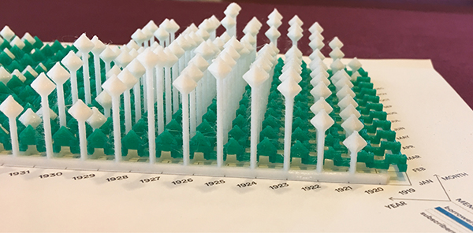
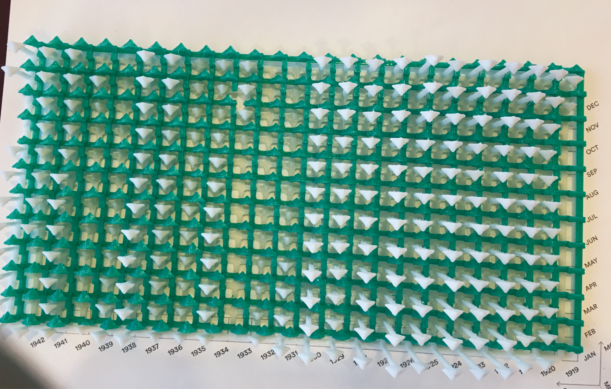
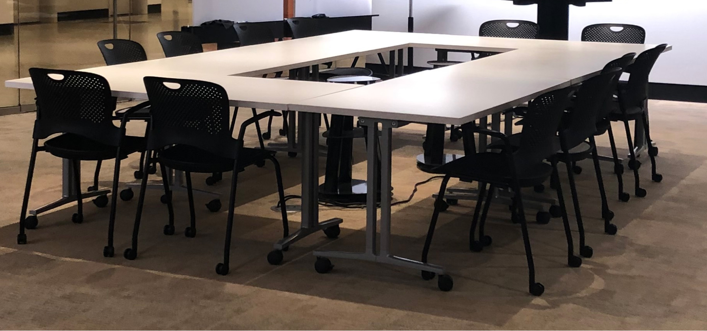

How do we represent tangible objects in a visual medium? We use words, pictures, and diagrams. We describe, share, show, and fail.

<!--more-->

Humanists continue to expand the range of objects they study, but the range of scholarly outputs has not seen a similar expansion. While there are movements within Digital Humanities to consider nontraditional formats, the presentation and publishing of these experimental works (such as installations and project demos) are still secondary or sidelined, where they exist at all. What would it look like to consider non-textual research outputs as first-order scholarly work? The historian David Staley suggests the terms “interpretive objects” or “humanistic objects” for creative scholarly acts that are not limited to text[^1]; Catherine D’Ignazio and Lauren Klein offer the broader term “rhetorical objects.”[^2] This kind of innovative work is carefully researched and theorized. It deserves scholarly engagement and intellectual rigor even if it does not fit into established modes of scholarly communication.

Academic research has a long history of textual practice and citation that we haven’t yet figured out how to adapt to non-textual scholarship. Both the [Journal of Open Humanities Data](https://openhumanitiesdata.metajnl.com/) and the [Journal of Open Source Software](https://joss.theoj.org/) can be seen as steps in this direction: they provide venues for the review and publication of data and software, respectively, accompanied by brief “metapapers.” But even these journals rely on transforming the content they review—data and software—into text in order to function! What are the implications if we truly expand the range of accepted scholarly outputs to include such interpretive objects as data structures, databases, software, datasets, physical objects, and augmented reality experiences? Will scholars need to become experts in all these modes, or can we find a way to become conversant in multiple forms of argumentation, as with other important scholarly theories?

The pieces that follow describe four different data physicalizations, which we consider to be one class of interpretive object. This is an exploration of our work as we wrestle with how to present physical objects in a non-physical medium, objects meant to be held, touched, or viewed from different angles. Not quite metapaper, manual, or manifesto — these are guides toward reading and thinking in creative new scholarly modes.[^3]



**SEE**

from a distance.  
Cold, commanding.  
Sense of mastery,  
but optical illusions deceive.

Look in a mirror.  
and see yourself  
seeing.  


**TOUCH**  

up close.  
Intimate, incomplete.  
Explore partial knowledge,  
enlighten slowly.  

Run fingers across skin  
and touch yourself  
touching.



Data physicalization represents data in physical form.[^4] Like other approaches to understanding and representing data, it highlights particular senses to communicate information, specifically touch and sight.[^5] But data physicalization is distinct from other sensory approaches in that it bridges the gap between creative, physical, and conceptual exploration, a nexus often associated with critical making.[^6] Data physicalizations surface the amount of labor involved with data production and representation, they lend data different perspectives and dimensions.[^7] These physicalizations also create an opportunity for viewers to become active participants in the making of a piece using data.

Data physicalization attempts to defamiliarize us from the many two-dimensional data representations we have seen by literally placing data in the _mise en scène_ of a conceptual exploration. There is something unique about turning data points into physical forms and placing them in space, something that triggers the mind to understand data in a distinctive way.

{{< figure src="images/conceptmap.svg" alt="Diagram defining the relationships between various data representations and the senses they incorporate; content available in description" caption="Concept map situating data physicalization in relation to other types of data representations and interpretations. Revised from the concept map included in the poster presented by the authors at DH2019 in Utrecht. Koeser, Rebecca Sutton, Nick Budak, Gissoo Doroudian, and Xinyi Li. “Data Beyond Vision,” July 11, 2019." attrlink="https://doi.org/10.5281/zenodo.3261531" desc-id="conceptmap-desc" >}}

⩩-----------------------------------------------------------------------------------⟩
| FIGURE.
|
| CAPTION: Concept map situating data physicalization in relation to other types of data representations and interpretations. Revised from the concept map included in the poster presented by the authors at DH2019 in Utrecht.
| ATTRIBUTION: Koeser, Rebecca Sutton, Nick Budak, Gissoo Doroudian, and Xinyi Li. “Data Beyond Vision,” July 11, 2019.
| LINK: https://doi.org/10.5281/zenodo.3261531
⩩-----------------------------------------------------------------------------------⟩


Other approaches for data representation and interpretation include:
- Data Visualization, which focuses on storytelling by using graphical elements
- Data Edibilization, which focuses on experiencing data through food using edible materials
- Data Sonification, which focuses on auditory patterns by using sound
- Data Visceralization, which focuses on physical and emotional experience by using multiple senses and affect, making it the only approach that emphasizes emotion.
- Data Art, which focuses on representing links between data and artistic creations by using expressive frameworks and raw data.
- Interpretive object, which focuses on revealing meanings and relationships via non-textual forms by using metaphors.


There is an ethics of drawing on other senses. Feminist philosopher Donna Haraway describes “visualizing technologies” as the “god trick of seeing everything from nowhere.”[^8] Klein and D’Ignazio expand on this, demonstrating that the assumed neutrality and objectivity of even the simplest visualizations always come from a particular perspective, usually a dominant cultural view that fundamentally excludes and marginalizes.[^fleventy-four]

This is especially the case when making data visualization accessible to vision-impaired readers. The typical solution is to provide a table with the data underlying the chart or graph. This isn’t practical for large datasets, and it’s clearly not the same experience; otherwise, we would provide the tabular data to all users. Another approach is to provide an extended description sharing the insights gained from the chart.[^9] This is helpful, but pre-digesting the chart in this way doesn’t allow readers to perceive and interpret the patterns and draw their own conclusions. Tactile data physicalizations provide sensory forms that offer individuals the opportunity to explore and discover patterns in the data for themselves.

Approaching an object like a data physicalization on display encourages bodily engagement in physical space. It encourages the person encountering it to consider multiple angles and perspectives, and it should raise questions about how the objects are meant to be read. This touching requires proximity and a certain intimacy.[^10] For Emmanuel Levinas, the “ocularcentrism” of western civilization has produced a false sense that vision is synonymous with objectivity; he proposes instead the metaphor of touch as the basis for ethical engagement with the Other. Ocularcentrism requires distance or separation and encourages objectification and mastery[^11] of that which is viewed. French feminist philosopher Luce Irigaray extends this metaphor[^12] in her notion of the “caress,” which “weds without consum(mat)ing.” Because touch requires intimacy, boundaries, and consent, it offers connection without the taint of mastery.[^13]

--------------------------------------------------------------------------------

These are not artist statements because this is not art; these objects might look like Data Art, but the goals and methods are different. This is representation, correspondence, laborious translation. These are our attempts to communicate our goals, to help you _read_ and interpret these unfamiliar objects, and to be challenged by the potential of physicalization.

We invite you to participate in the embodiment and visible labor of data work. Download the following models and instructions, use your hands to recreate the data physicalizations we developed, or use them as inspiration to make your own interpretive objects. If you make any of these physicalizations, please share them on social media with the hashtag [#DataBeyondVision](https://twitter.com/search?q=(%23DataBeyondVision)).


Choose an object



Folding in the Lesser-Known Members of the Shakespeare and Company Lending Library {#folding}
--------------------------------------------------------------------------

_Nick Budak, Xinyi Li_

### Goal
The Shakespeare and Company lending library is best known for its famous members — writers such as Gertrude Stein, James Joyce, Ernest Hemingway, Aimé Césaire, and Simone de Beauvoir. We wanted to highlight the activity of the relatively unknown members — many of them women — who in fact represent a much larger portion of the library's day-to-day activity and thus arguably better represent it than do the prominent names. This piece makes use of unit origami to create a larger, cohesive form from small folded units, mirroring the relationship between the overall membership of the library and a single member.[^14]



⩩-----------------------------------------------------------------------------------⟩
| FIGURE. Folded origami model of a green cube intersecting a white octahedron covered with printed text.
|
| CAPTION: Completed piece on display at the Center for Digital Humanities, with early drafts visible in background.
| ATTRIBUTION: Photo by Shelley Szwast.
⩩-----------------------------------------------------------------------------------⟩


### Description
The physicalization contrasts the activity of the better-known members of the lending library — those linked by researchers to an entry in the [Virtual International Authority File](https://viaf.org/) (VIAF)[^15] — with the activity of relatively unknown members with no known authority record.[^16] Activity is represented by the total number of borrowing events that would plausibly have brought members into the library, namely checking out and returning books. Names of the lesser known members are printed on the paper used to create the octahedron as a way of corporealizing and “re-humanizing” humanities data.[^17] By holding the physicalization in two different ways, the user can “grasp” two separate sets of data: the octahedron (non-famous members) and the cube (famous members). The ratio of the volumes of these two solids reflects the use of the library by these two different groups.[^18]



⩩-----------------------------------------------------------------------------------⟩
| FIGURE. 3-D model of a green cube intersecting a white octahedron covered with printed text.
⩩-----------------------------------------------------------------------------------⟩


### Insights



⩩-----------------------------------------------------------------------------------⟩
| FIGURE. A pie chart with a 70% majority section labeled “no VIAF” in green, with the remainder labeled “VIAF”.
|
| CAPTION: A pie chart representing the proportions of members with and without VIAF identification.
⩩-----------------------------------------------------------------------------------⟩


The majority section of the pie chart represents the 14,583 library members who we identified as “lesser-known” because they are not listed in VIAF. The minority section represents the 6,248 members who are listed in VIAF, often because they were involved with a well-known creative work.


A pie chart can be used to present the same ratio of data conveyed in the physicalization; this representation is useful when we want to illustrate a situation where we know the totality of the data. Pie charts also depict a world where data fits neatly into mutually exclusive categories. The act of grasping the two intersecting solids in our physicalization is a response to this approach: the membership data of the lending library is a work in progress, updated as researchers comb through archives that are fragmentary and incomplete. One cannot see all sides of a three-dimensional solid simultaneously. By representing our data as intersecting solids, we instead mirror the fuzzy distinction between “famous” and “non-famous” members, acknowledging the intersection of the varied identities of the library’s members.[^19]

### Next Steps
Using cut, punched, or embossed paper would make the piece more tactile; instead of simply printing names, unique patterns could be added to represent membership and borrowing activities for individual members. In the future, we could use generative methods to create unique folding patterns for individual library member activity and make them available via print-on-demand. This would enable viewers to become participants and turn folding into an act of recovery of the stories of the lesser-known library members.[^20]


Choose a different object



Modeling Shakespeare and Company Library Membership {#modeling}
---------------------------------------------------

_Rebecca Sutton Koeser_

### Goal


⩩-----------------------------------------------------------------------------------⟩
| FIGURE. 3D printed object and accompanying 3D printed labels laid out on a table; this side view shows labels for the years, 1919–1942.
|
| CAPTION: Side view of 3D printed lollipop chart with labels and statement.
| ATTRIBUTION: Photo by Shelley Szwast.
⩩-----------------------------------------------------------------------------------⟩


This data physicalization demonstrates the affordances of three dimensions for representing data: time series data are displayed with sequential months and years adjacent to each other, which makes it easier to discern seasonal and annual trends. I hope to inspire others to try experimental approaches to representing data; writing software to generate printable 3D models directly from the data makes the process reproducible, and may eventually enable others to create and print their own physicalizations. The tactile nature of the object suggests the possibilities of 3D printing to create more accessible representations of data.



⩩-----------------------------------------------------------------------------------⟩
| FIGURE. Alternating rows of white and green “lollipops” fade into the distance and out of focus, with the white data points noticeably larger in the foreground.
|
| CAPTION: Close-up of 3D printed lollipop chart with labels.
| ATTRIBUTION: Photo by Shelley Szwast.
⩩-----------------------------------------------------------------------------------⟩


### Description
This is a two-variable, three-dimensional lollipop chart showing the membership of the Shakespeare and Company lending library, by month and year, from November 1919 when Sylvia Beach opened her bookshop to its official closing in 1941.[^21] Membership data are drawn from two different sources, both of which are incomplete: broad membership information comes from [logbooks](https://shakespeareandco.princeton.edu/sources/logbooks/) (although logbooks for 1930, parts of 1931–32, and 1937 are missing); detailed borrowing histories come from [lending library cards](https://shakespeareandco.princeton.edu/sources/cards/) for a subset of members.[^22] The white octahedrons represent the number of members with an active membership in each month; the green icospheres correspond to the number of members with borrowing activity in each month.[^23] For any month where the value is zero, there is no lollipop. Representing the two different datasets as adjacent, half lollipops exposes the discrepancies between the stories these sources tell us about the membership of the library without privileging either of them.[^24] Using two different shapes makes the two parts of the physicalization distinguishable to touch. The two lollipop charts are designed to be printed independently and then assembled, so that any 3D printer can be used. In this version, the two pieces slide together; this is both a simplification and an improvement over the previous version, where one piece was placed on top of the other.[^25]



⩩-----------------------------------------------------------------------------------⟩
| FIGURE. 3-D model of Shakespeare and Company membership lollipop chart.
⩩-----------------------------------------------------------------------------------⟩


### Insights


⩩-----------------------------------------------------------------------------------⟩
| FIGURE. Bar chart showing members with borrowing activity and total members each month.
|
| CAPTION: Shakespeare and Company lending library members with borrowing activity and members, 1919–1941.
| ATTRIBUTION: Kotin and Koeser, “The Shakespeare and Company Lending Library Cards in Context.”
| LINK: http://shakespeareandco.princeton.edu/analysis/2020/03/shakespeare-and-company-lending-library-cards-context/
⩩-----------------------------------------------------------------------------------⟩


Plotting documented membership accounts against borrowing activity shows the differences in members tracked across the two sources. The Shakespeare and Company Project has information about the borrowing activity of 11% of lending library members. For the 1920s, the percentage is lower: only 6%. But in the 1930s, the percentage is higher: 23%. Some months show more members with borrowing activity than total members because information on the cards overlaps gaps in logbook coverage.


The same membership data can be presented in a two-variable bar chart. Overall trends are easy to see, and both representations of the data make it possible to compare the two data series against each other. Seasonal trends are visible in the bar chart, but it’s difficult to identify distinct months; in contrast, changing perspective on the 3D lollipop chart allows us to focus on yearly or monthly trends. Missing data in one variable are visible in both, but seem more striking in the 3D version where the base of the piece is bare without any lollipop tops. At the current scale, touching the piece requires focusing attention on just a portion of the object but invites exploration, which can proceed in any direction.[^26] While the bar chart demands sequential reading from left to right, the 3D printed object doesn’t provide or demand a particular starting point or sequence.

The bar chart conveys a sense of certitude and exactness that does not reflect the missing and partial data that underlie it; the 3D printed object, with its irregularities and fragility, is more representative of the contingent, historical data.[^27]

### Next Steps
The current version uses different shapes for the two variables, but adding textures would make the model even more tactile. Simple 3D printed labels with text and braille have been added for display alongside the piece, but they could be incorporated directly on the model, and refined to provide a scale for the axes.[^28] The 3D printed objects could also be augmented with other media: lights or sound could convey the intensity of borrowing activity, or threads connecting months could represent the number of subscription renewals and convey a sense of continuity. The Python code used to create these models could be generalized for reuse, and eventually made available as a Blender plugin.[^29] New shapes or approaches could be used to leverage innovations in 3D modeling, such as generative design, to create objects that are more inviting to touch and even more distinct from 2D data visualizations. 3D models could be revised for fabrication with CNC machines to create objects out of wood instead of plastic, which could make them more inviting to touch.

[Make one >](/issues/1/modeling-howto/)


Choose a different object



Weaving Derrida’s References {#weaving}
----------------------------

> … we all of us, grave or light, get our thoughts entangled in metaphors…
><cite> George Eliot, Middlemarch</cite>

_Rebecca Sutton Koeser, Gissoo Doroudian_

### Goal
With this piece, we aim to literalize the metaphor of weaving as writing, embedded in the very words “textile” and “text,” by representing Derrida’s intertextuality as a woven tapestry.[^30] The textures of the yarn and woven fabric invite touch, but by showing an in-progress weaving with the pattern and instructions provided, we move viewers beyond seeing and touching to enable them to become participants in reconstructing the data. Showing the weaving in progress also foregrounds the labor of data work, since curation, collection, and visualization all take an enormous amount of work and skill, often from a range of different individuals.

{{< deepzoom tile="https://iiif.princeton.edu/loris/iiif/2/figgy_prod%2F58%2F51%2Fd4%2F5851d48b225b42699a13181c778a6095%2Fintermediate_file.jp2/info.json" alt="Interactive zoomable viewer displaying a blue scarf with alternating bands of varied threads." pdf-img="images/weaving-deepzoom-alt.jpg" pdf-alt="Composite of two images from the high resolution image shown in the deep zoom viewer: one showing the full length of the woven piece, and another with a close-up showing the threads and different weaving patterns." height="10em">}}

⩩-----------------------------------------------------------------------------------⟩
| FIGURE. Interactive zoomable viewer displaying a blue scarf with alternating bands of varied threads.
⩩-----------------------------------------------------------------------------------⟩


### Description
This weaving represents the references in chapter one of Jacques Derrida’s _de la Grammatologie_ (1967). The references have been cataloged and categorized by the research team of Derrida’s Margins.[^31] Each type of reference (epigraph, citation, quotation, footnote) is represented by a distinct yarn and weaving pattern. Derrida’s highly intertextual writing suggested the idea of weaving.[^32] Using yarn to symbolize the foundational work of deconstructionism, which operates by finding the place where a text unravels, gives additional depth to this physicalization.

Working with textiles is often stereotyped as female activity, therefore this piece also raises questions of gender and other false binaries such as art versus craft, high- versus low-tech. Based on anthropological research, women produced most of the textiles in the ancient world, but that work can be read as female authorship involved in the earliest textual practices.[^33] The loom itself runs the gamut from high to low technology: a backstrap loom can be assembled at home from dowels, rods, and cords; and yet, Joseph-Marie Jacquard’s 1801 power loom, which used punch cards to automatically create elaborate woven patterns, was an important precursor to early computers.



⩩-----------------------------------------------------------------------------------⟩
| FIGURE. The weaver sits in front of a table-top loom; one hand lifts two strand of the warp yarn, the other stretches out the yarn being looped around it.
|
| CAPTION: Gissoo, creating a Soumak weave.
⩩-----------------------------------------------------------------------------------⟩


### Insights
The data encoded in the weaving could be represented as a stacked bar chart, a familiar and easily available choice for communicating types and quantities. However, the bar chart may be the least effective for communicating the depth and conceptual nuance of data on multiple levels.



⩩-----------------------------------------------------------------------------------⟩
| FIGURE. Stacked bar chart showing number and kind of references by page.
|
| CAPTION: References in chapter 1 of Of Grammatology by page and type. (Chapter 1 begins on page 15).
⩩-----------------------------------------------------------------------------------⟩


The chart shows that quotations are the most common type of reference in chapter one, and a few pages include six or more quotations. Footnotes are the next most common reference; there is only one epigraph, on the first page in the chapter, and one citation, on page 35. Only six pages have no references at all, and many pages have more than one.


The ability to feel the density and frequency of each type of reference, color coded above, creates a unique experience for each participant, specific to their own perspective. These organic experiences bring to light the depth and complexities of the original work as well as the labor involved with gathering this data. This woven piece, which represents the first half (thirteen pages) of the first chapter of _Of Grammatology_ is thirty-seven inches long, a little more than three feet. The physical nature of this data representation required that materials and dimensions be carefully calculated and measured.[^34] The process of creating this piece is embodied and experiential, which naturally leads to conversations that effortlessly surface the labor of data work and the depth of the original text. Unfortunately, this is less likely to happen naturally when creating data visualizations.

### Next Steps
Adding conductive thread and sensors could turn the weaving into an interface, so that touching the fabric would bring up the relevant reference on an associated screen. Data weavings could also be augmented with other media, such as lights and sound to convey other aspects of the same or related data. Incorporating other work on automated weaving and knitting machines would add to the variety of options for data textiles.

[Make one >](/issues/1/weaving-howto/)


Choose a different object



Stacking New and Continuing Membership Activities of the Shakespeare and Company Lending Library {#stacking}
------------------------------------------------------------------------------------------------

_Xinyi Li_

### Goal
This piece aims to reveal the continuity and growth of Sylvia Beach’s lending library by showing the extent of activity and recorded membership based on logbooks and lending library cards. Multiple variables are encoded in the dimensions of stacking boxes based on the technique of pop-up box folds. By exhibiting the evolution of the library over time while contrasting activities of new and old members, this piece enables multiple ways to compare and interpret the data. By transforming a flat surface to a three-dimensional form with play of light and shadows, this production technique serves as a metaphor for the larger purpose of the [Shakespeare and Company Project](https://shakespeareandco.princeton.edu/) — bringing archival data to life and facilitating rich interpretations.



⩩-----------------------------------------------------------------------------------⟩
| FIGURE. Animated GIF with the camera panning revealing different portions of the paper model.
|
| CAPTION: Overview of a folded model representing the lending library membership activities from 1919–1941.
⩩-----------------------------------------------------------------------------------⟩


### Description
[Shakespeare and Company Project](https://shakespeareandco.princeton.edu/) lending library membership data from 1919 to 1941 are represented as a hybrid of time-series and stacked bar charts showing part-to-whole relationships made from paper and folding. Each unit, a cuboid in space and sometimes its stacking child, represents one year and displays nine variables for that year. The height corresponds to the number of active members recorded in the [logbooks](https://shakespeareandco.princeton.edu/sources/logbooks/); the depth depicts the number of members with borrowing activity, according to each member’s [lending library card](https://shakespeareandco.princeton.edu/sources/cards/); the length along the timeline is based on the total number of borrowing events.[^35] Each of the variables is split into two parts: previous members who have renewed a membership contrasted with new members. The upper portion shows the growth and the activities of new readers. Viewers can see the rise and fall of members, inspect the difference between members with borrowing activity and the members as represented in the logbooks, compare the growth over time by viewing the stacking part from the front, and survey the involvement of continuing members versus new members, to name a few possibilities. In some cases, a small number of new members were very active readers based on their borrowing activity.



⩩-----------------------------------------------------------------------------------⟩
| FIGURE. Textual labels overlaying a 3D rendering of a unit of the folded model along its three directions.
|
| CAPTION: Legend showing how to read the information represented in three dimensions.
⩩-----------------------------------------------------------------------------------⟩


This physicalization made use of kirigami technique, which transforms single sheets of paper into three-dimensional forms. Data was mapped to the shapes with [Data Illustrator](http://data-illustrator.com/), semi-manual calculation, and vector drawing. The materiality and the process have a poetic connection to the subject matter, metaphorically: stories and knowledge can be embedded on flat papers, but the act of reading unfolds the surface into interpretive space even beyond three dimensions.



⩩-----------------------------------------------------------------------------------⟩
| FIGURE. 3D model showing a folded long paper as base, with opened cuts folded into additional panels.
⩩-----------------------------------------------------------------------------------⟩


### Insights



⩩-----------------------------------------------------------------------------------⟩
| FIGURE. A series of stacked bar charts comparing the number of members, numbers of borrowers, and borrowing events, and the portion of new and renewed members among each of these categories.
|
| CAPTION: Membership activities of Shakespeare and Company Lending Library from 1919–194 represented as stacked bar charts.
⩩-----------------------------------------------------------------------------------⟩


Members with borrowing events constitute a fraction of all the members in the earlier years. The overall number of borrowing events increases gradually from 1919 to 1926, drops off slightly, then evidently increases from 1934 to 1939, even though the number of members drops drastically after 1929. It’s not easy to compare book borrowing by new members across the years.


With current off-the-shelf visualization tools like the ones that come with Google Sheets, these three data series can generate three separate stacked bar charts. Since the numbers have different ranges, the vertical axes are drawn in different scales, which makes comparison across series impossible. The aggregate version presented here required manual adjustment to combine the separated charts and to make the Y axes comparable. In this 2D version, various activities of the growing membership body are not linked, and it’s difficult to draw connections between active members and the intensity of their activities because spatially these bars are not adjacent to each other. In the conventional pie charts, although the part-whole relationship between new membership activity and all activity is apparent, comparing across the three types of activities is not possible.




⩩-----------------------------------------------------------------------------------⟩
| FIGURE. A series of pie charts comparing the number of members, numbers of borrowers, borrowing events, and the portion of new and renewed members among each of these categories.
|
| CAPTION: Membership activities of Shakespeare and Company lending library between 1919 and 1941 represented as pie charts.
⩩-----------------------------------------------------------------------------------⟩


Overall, renewed members outsize new members before 1929, followed by five years with nearly two times more new members than renewed members. Members with borrowing events represent a fraction of all the members in the early years between 1919 and 1929. Then members with borrowing events grow and become more comparable to the size of all members, which sizes down drastically after 1929. Borrows from new members outsize renewed members since 1934. It is not easy to compare the proportion of growth across the years.


Extending into physical space allows data to be encoded in three axes and provides multiple possible angles to view the piece, depending on the relationships one is interested in. Different angles can reveal new interactions between logbook members, members with lending library card activities, and borrowing events. The separation of renewing and new members makes it possible to juxtapose and compare activities between the two groups of members. Spatial factors communicate different facets of the data, and color coding is no longer required.

Throughout the process of developing this project as practice-based research, making and reflecting are in constant oscillation, and knowing happens in actions. As I worked through this piece and observed the artifact, new questions emerged: how do we measure the level of liveliness of the lending library? Is it by the number of members or by the number of borrowing events? Instead of drawing comparisons by the lengths along each axis, perhaps this physicalization also introduces another way to look at the vibrancy of the lending library: through the volumes and relative sizes of the cuboids and rectangles, which factor in both the number of members and the borrowing activity.

### Next Steps
The pattern generation process is very programming-friendly and the materials required are also easily accessible. The data encoding process could be automated by custom code, which could then be made available as a tool for presenting part-to-whole relationships in other datasets. With the addition of dynamic media such as projection mapping, this piece could convey more context and narratives around the lending library.

[Make one >](/issues/1/stacking-howto/)


Choose a different object



## Acknowledgments
Photos of the data physicalizations on display and Gissoo Doroudian weaving are by Shelley Szwast. The high resolution capture of the data weaving used for the deep zoom and margin image was created by the Digital Imaging Studio, Princeton University Library. The photo of the CDH main space with empty tables is by Mana Winters. The custom visuals for this essay were created by Doroudian; the icons for each section were created by Doroudian and revised by Doroudian and Xinyi Li. All other photos, charts, and models were created by the authors.

Thanks to our collaborators on the [Shakespeare and Company Project team](https://shakespeareandco.princeton.edu/about/credits/) and [Derrida’s Margins project team](https://derridas-margins.princeton.edu/credits/) for their work to create the data we have experimented with and physicalized here; to the [ACH2019 conference organizers for the generous CFP](http://ach2019.ach.org/cfp-call-for-participation-en/) with the option of installations, which led in part to this work; and to the [Center for Digital Humanities at Princeton](https://cdh.princeton.edu/) and our colleagues there for the tremendous support and encouragement for this project. Special thanks to our colleagues at Princeton University Library, Meghan Testerman and Annette Jushchuk, for participating in a weaving exhibition test run and giving us feedback to improve the instructions.

[^1]: David Staley, “On the ‘Maker Turn’ in the Humanities,” in _Making Things and Drawing Boundaries: Experiments in the Digital Humanities_, ed. Jentery Sayers (Minneapolis: University of Minnesota Press, 2017), 32-41, https://doi.org/10.5749/j.ctt1pwt6wq.5.
[^2]: “Any communicating object that reflects choices about the selection and representation of reality is a rhetorical object.” Catherine D’Ignazio and Lauren F. Klein, _Data Feminism_ (Cambridge: MIT Press, 2020), 78.
[^3]: These pieces are based on statements—partly inspired by artist statements—that were included as part of the “Data Beyond Vision” installation presented at the ACH2019 conference. However, we have considerably expanded and adapted them, moving beyond that format. Rebecca Sutton Koeser, Nick Budak, Gissoo Doroudian, and Xinyi Li, “Data Beyond Vision,” Installation presented at ACH2019, Pittsburgh, July 25, 2019.
[^4]: The term data physicalization can be understood in three ways: as a “physical artifact whose geometry or material properties encode data”; as the process of giving physical form to data; or, as the research area combining data visualization and tangible user interfaces.  See Yvonne Jansen et al., “Opportunities and Challenges for Data Physicalization,” in _Proceedings of the 33rd Annual ACM Conference on Human Factors in Computing Systems_ (April 2015), 3227–36. https://doi.org/10.1145/2702123.2702180.
[^5]: To get a better sense of the variety and historic range of data physicalizations, browse a gallery of physical visualizations and related artifacts at http://dataphys.org/list/gallery/.
[^6]: Read more about “Critical Making”, which was coined by Matt Ratto, at https://criticalmaking.com/matt-ratto/.
[^7]: This work is strongly aligned with the principles of data feminism—in particular, elevating emotion and embodiment; considering context; and making labor visible. D’Ignazio and Klein, _Data Feminism_, 17–18.
[^8]: Donna Haraway, "Situated Knowledges: The Science Question in Feminism and the Privilege of Partial Perspective," _Feminist Studies_ 14, no. 3 (Autumn 1988): 581. https://doi.org/10.2307/3178066.
[^fleventy-four]: D’Ignazio and Klein, _Data Feminism_, 76.
[^9]: We’re trying out this approach on research partnership projects we’ve worked on at the Center for Digital Humanities at Princeton. Read the [GitHub issue where we discussed the implementation](https://github.com/princeton-cdh/mep-django/issues/404), the [article that inspired our approach](https://www.sarasoueidan.com/blog/accessible-data-charts-for-khan-academy-2018-annual-report/), and an example of it in use in a [Princeton Prosody Archive Editorial essay](https://prosody.princeton.edu/editorial/2020/01/visualizing-collections/). The journal you are now reading also experiments with this approach. See the [GitHub pull request](https://github.com/Princeton-CDH/startwords/pull/95) where we discussed a plain text caption and alt-text schema.
[^10]: The difficulty and unfamiliarity of this intimacy may be demonstrated in part by our experience with displaying these objects. We often have to encourage and reassure people that they are allowed to touch these items, even though there are signs clearly posted inviting just that.
[^11]: Mastery is a problematic term, as African-Americans and members of other marginalized groups know well, and as the racial unrest in the United States this summer has made White Americans more aware. Klein and D’Ignazio also point out that the term has a gendered component as well, with the master stereotype associated with men across many Western cultures. _Data Feminism,_ 77. For a discussion of “master” and its unfortunate use in technology, see “Toward anti-racist technical terminology,” Association for Computers and the Humanities (ACH), accessed October 22, 2020. https://ach.org/toward-anti-racist-technical-terminology/
[^12]: “Levinas is one of few philosophers to displace the metaphor of vision dominating ontological accounts of intersubjectivity into a metaphor of touch … which resonates with Irigaray’s own reformulation of subject-object relations in the figure of the two lips.” Ince, Kate. “Questions to Luce Irigaray.” _Hypatia_ 11, no. 2 (1996): 122–40. http://www.jstor.org/stable/3810267
[^13]: “This gesture . . . which weds without consum(mat)ing .. may be called: the touch of the caress. . . . This touch binds and unbinds two others in a flesh that is still and always untouched by mastery.” Luce Irigaray, _An Ethics of Sexual Difference_, trans. Carolyn Burke and Gillian C. Gill (Ithaca: Cornell Press, 1993), 186.
[^14]: This technique, also called “modular origami,” uses separate sheets folded into repeated interlocking small forms. The practice is attested as early as the eighteenth century, but gained popularity in the 1960s with the work of Robert Neale in the United States and Mitsunobu Sonobe in Japan. Our model uses forms from Tomoko Fuse’s book, _Unit Origami: Multidimensional Transformations_ (Tokyo: Japan Publications, 1990).
[^15]: VIAF aggregates records from multiple national libraries with authoritative names for people, organizations, and titles. Typically only people associated with published works, such as authors and translators, have records in VIAF; we used this as a proxy for some degree of fame, even though there are plenty of names in VIAF that are not strictly famous.
[^16]: This work is based on pre-release versions of the datasets now published as: Joshua Kotin et al., _Shakespeare and Company Project Dataset: Lending Library Members, Books, Events_, version 1.0, July 2020, distributed by DataSpace, Princeton University, https://doi.org/10.34770/pe9w-x904. For more information, see https://shakespeareandco.princeton.edu/about/data/
[^17]: This is inspired in part by ethical principles from the Colored Conventions Project, which asks researchers using their data to “contextualize and narrate the conditions of the people who appear as ‘data’ and to name them when possible.” “Introduction to CCP Corpus,” Colored Conventions Project, accessed October 22, 2020.
[^18]: We wanted to include a 3D model of this physicalization in order to provide some semblance of virtually grasping and rotating the object. Because we didn’t have a way to capture the actual object in 3D, we created a model of it in Blender; this was fairly straightforward, since it consists of two simple shapes.
[^19]: For more on the strengths and weaknesses of the pie chart, see Steve Johnson, “The Case Against Pie Charts,” University of Utah Health, March 3, 2017, https://accelerate.uofuhealth.utah.edu/connect/steves-dojo-7-the-case-against-pie-charts.
[^20]: We do not provide a how-to for this object out of respect for the copyright of origami authors, who often spend years developing and refining single designs. The three-dimensional forms used to make this piece are a combination of two modular origami units which are the original creations of the brilliant Tomoko Fuse, and can be found in her book _Unit Origami_. The octahedron is formed from eight units with triangular windows, and these windows are filled with eight so-called E-b units that create the illusion of an intersecting cube. Fuse, _Multidimensional Origami, 109, 233. When assembling from your own paper, you can print [a document containing the names of the non-VIAF members of the library](https://startwords.cdh.princeton.edu/issues/1/data-beyond-vision/non_viaf_names.pdf) onto the paper before folding the octahedron. Sheets of 8.5 inch x 11 inch copy paper can become difficult to manipulate when folded many times; thinner paper is easier to work with.
[^21]: A [lollipop chart](https://datavizproject.com/data-type/lollipop-chart/) is a bar chart variant that uses dots to mark the values. Earlier prototypes of this model were based on bar charts, but I discovered that the space between bars in a lollipop chart made it easier to “read” the 3D version, since the thinner vertical supports obscure less of the model visually.
[^22]: This work is based on pre-release versions of the [datasets now available](https://shakespeareandco.princeton.edu/about/data/). Kotin et al., Shakespeare and Company Project Dataset: Lending Library Members, Books, Events.
[^23]: We use white and green in our physicalizations of data from the Shakespeare and Company Project because green is the most iconic color used in the site design. 
[^24]: To better understand the Shakespeare and Company Project sources, see Shakespeare and Company Project, “Lending Library Cards,” Center for Digital Humanities, Princeton University, November 20, 2019, https://shakespeareandco.princeton.edu/sources/cards/; and Shakespeare and Company Project, “Logbooks,” Center for Digital Humanities, Princeton University, November 20, 2019, https://shakespeareandco.princeton.edu/sources/logbooks/. To understand how the Project data from those sources fit together, read Joshua Kotin and Rebecca Sutton Koeser. “The Shakespeare and Company Lending Library Cards in Context,” Shakespeare and Company Project, Center for Digital Humanities, Princeton University. March 9, 2020, http://shakespeareandco.princeton.edu/analysis/2020/03/shakespeare-and-company-lending-library-cards-context/.
[^25]: The previous version was more complicated to print; the overlapping framework interfered with small data points, and the tightly interlocking parts did not scale well.  
[^26]: Due to COVID-19, I’m writing and revising this from my home office without physical access to the object in question. I find myself closing my eyes and extending my fingers to focus on my memories of touching the object.
[^27]: For an exploration of the subjectivity, uncertainty and interpretation implicit in data, read [Rebecca Munson’s essay](https://startwords.cdh.princeton.edu/issues/1/their-data-ourselves/) in this issue of _Startwords_. For an overview of common techniques for representing uncertainty visually, see Nathan Yau, “Visualizing the Uncertainty in Data,” _FlowingData_ (blog), January 8, 2018, https://flowingdata.com/2018/01/08/visualizing-the-uncertainty-in-data/. For more on the difficulty people have in recognizing uncertainty in data visualization, see D’Ignazio and Klein on “Visceralizing Uncertainty” in _Data Feminism_, 88.
[^28]: These have not yet been tested by anyone who reads braille.
[^29]: [Blender](https://www.blender.org/) is an open-source 3D modeling creation suite which includes a Python API. I experimented with multiple other solutions for generating 3D models programmatically, including [OpenSCAD](https://www.openscad.org/) and [Tangible](https://github.com/dbrgn/tangible), but found they were too limited and couldn’t handle a model of the size and complexity I needed to generate for this dataset, so I eventually settled on Blender and Python. The blender interface makes it possible to view and modify models generated from code, there is [documentation for the Python API](https://docs.blender.org/api/current/), and I found many helpful answers on [Blender Stack Exchange](https://blender.stackexchange.com/).
[^30]: The word “text” comes from Latin _textus,_ literally “thing woven” and from the verb _texere,_ “to weave.” According to Kathryn Sullivan Kruger, “the connection between weaving (textiles) and language (texts) becomes so entangled as to be almost impossible to separate. In many languages, including English, the verb to weave defines not just the making of textiles, but any creative act.” Kathryn Sullivan Kruger, _Weaving the Word: The Metaphorics of Weaving and Female Textual Production_ (Cranbury, NJ: Rosemont Publishing & Printing, 2001), 29. To play on one of Derrida’s most famous statements, “_il n'y a pas de hors-textile._”
[^31]: Kate Chenoweth et al., “References in Jacques Derrida's _de la Grammatologie_,” September 10, 2018, Figshare, https://doi.org/10.6084/m9.figshare.7180448.v1.
[^32]: For a deeper exploration of textile metaphors in Derrida’s work, see Caroline Rooney’s “Deconstruction and Weaving” in _Deconstructions: A User's Guide,_ edited by Nicholas Royle (London: Palgrave, 2000), https://doi.org/10.1007/978-1-137-06095-2_14.
[^33]: See Kruger, _Weaving the Word,_ 21, 34, 136.
[^34]: When we first did the math on the weaving and measured, we discovered that doing all of chapter one would require a warp longer than three tables end-to-end in the CDH main space, which is why we scaled back to just half of the chapter. 
[^35]: This work is based on pre-release versions of the [datasets now available](https://shakespeareandco.princeton.edu/about/data/). Kotin et al., _Shakespeare and Company Project Dataset_.
[^36]: The 3D model was generated by [Origami Simulator](https://origamisimulator.org) using the vector crease patterns created to guide the folds. The 3D viewer, by enabling wandering and viewing in a virtual space from different angles, emulates the experience of engaging with this piece in person.
