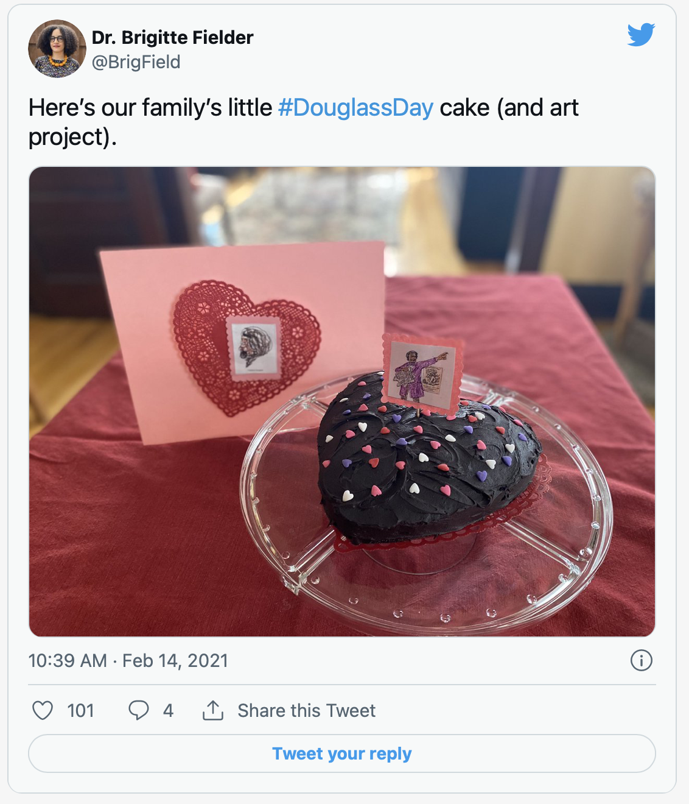
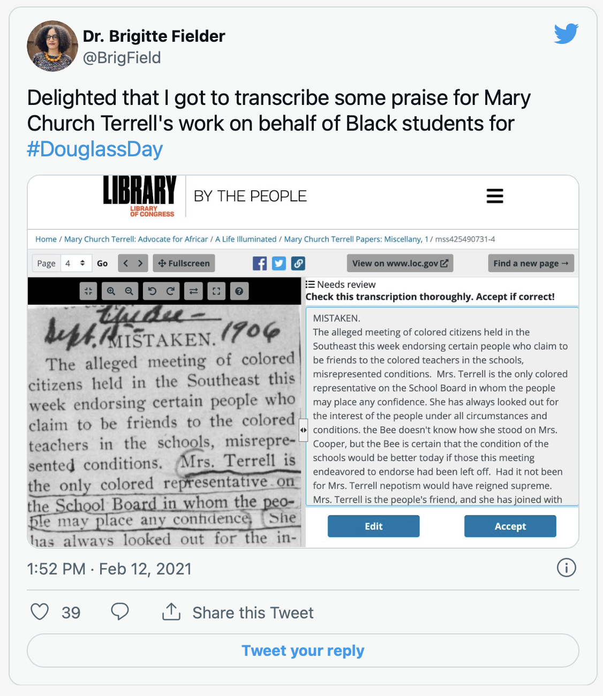
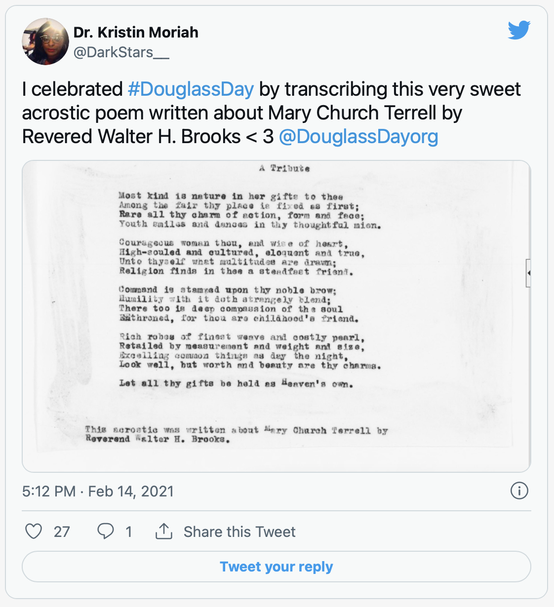
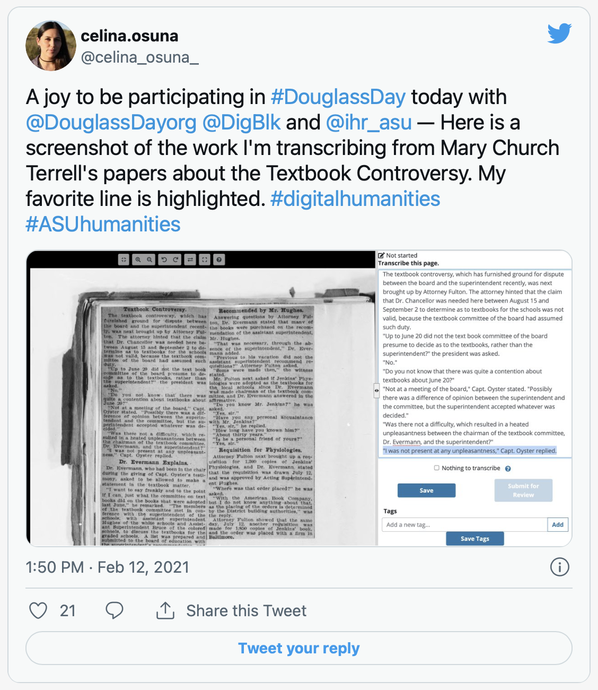








    Save the Date for Douglass Day 2022!

    Help us find the names of Black women in the Colored Conventions. Where did they go?

    Registration is now open. Sign up for updates & more! https://t.co/nbxI9l1lGT pic.twitter.com/5bz5fRQVLR
    — Douglass Day (@DouglassDayorg) October 8, 2021


## Douglass Day’s annual celebrations before the pandemic

In 2017 we began to hold an event celebrating Frederick Douglass’s chosen birthday of February 14. Our event invites people to help transcribe digitized collections of African American history and culture, and to host transcribe-a-thon parties with their friends, classmates, or colleagues. Thousands have participated over the years.[^1]

Each year, we listen to the melodies of “Lift Every Voice and Sing” and eat birthday cake. Our livestreamed broadcast and social media posts go out to thousands. We share photos on Twitter and Instagram of libraries, community centers, and churches where people transcribe shoulder to shoulder. At our local events, we enjoy seeing strangers chat about what they found or learned. Our events expand who gets to help preserve and commemorate Black history.

We started this event from scratch in 2017. By the time we held our events at Howard University in 2020, we felt like we’d attained some momentum with our team members at the University of Delaware, Princeton’s Center for Digital Humanities, and the Center for Black Digital Research at Pennsylvania State University.[^2]


  


## Adjusting During the COVID-19 Pandemic

Then the COVID-19 pandemic arrived. We had lessons for building community from years past. Yet even though we had been livestreaming and tweeting since 2017, we had few models for building a virtual, distanced community. We spent months of difficult planning to adapt our previous model into a virtual format.

Crucially, we connected with Lauren Algee and Carlyn Osborn at *[By the People](https://crowd.loc.gov/)*—a Library of Congress project—to feature their campaign transcribing the papers of Mary Church Terrell, a groundbreaking Black feminist educator, activist, intellectual, and writer.

In the end, we managed to hold an event in February 2021 that retained the best parts of our past celebrations through lots of perseverance and creativity.

This snippet serves as a reflection on that transition. We’re sharing our hard-won lessons to help any others who might face similar challenges while hosting virtual and accessible events that foster ethical communities.

## Redefining our (digital) connections

One of our principles is to create communal spaces that engage Black communities in remembering Black history.[^3] As we struggled with the constraints of pandemic isolation, we saw opportunity in our collective digital shifts. Could we use this opportunity to reimagine how we connect with our diverse audiences, spread the word about our events, and adapt our previous community engagements?

This process of rethinking our outreach transformed our use of online communications (social media, newsletter, and tutorial videos). We found new ways to connect with our audiences using tools in novel ways.

## Transforming Outreach

Launching our social media campaign early on helped attract attention to the event and prepare our audiences for the redesigned event. We also created new hashtags, such as our [#GreatDouglassDayBakeoff](https://twitter.com/search?q=%23GreatDouglassDayBakeoff&src=typed_query).

*******











    Picked @joythebaker ‘s excellent chocolate-peanut butter pretzel layer cake for #TheGreatDouglassDayBakeOff #DouglassDay @CCP_org @DouglassDayorg @DigBlk pic.twitter.com/lElhFccO1f
    — Anna Lacy (@Anna_E_Lacy) February 12, 2021

    Here’s our family’s little #DouglassDay cake (and art project). pic.twitter.com/azzJnIReHv
    — Dr. Brigitte Fielder (@BrigField) February 14, 2021

    #DouglassDay bakeoff! This flourless chocolate wave cake by @clairesaffitz pairs really well with a good book like @alisonmparker1’s #MaryChurchTerrell bio UNCEASING MILITANT. pic.twitter.com/02RCvBZQ9n
    — Debbie Gershenowitz (@DGershenowitz) February 14, 2021

    #DouglassDay #GreatDouglassDayBakeoff got a little carried away this year pic.twitter.com/inppgsFemp
    — Hannah Alpert-Abrams 🤖✊🔮 (@hralperta) February 14, 2021

    “Power concedes nothing without a demand.” Happy #DouglassDay! @CCP_org @librarycongress “If there is no struggle, there is no freedom.” -FD pic.twitter.com/EM9CtUxDwq
    — Pierce Stanley (@piercestanley) February 14, 2021



*******

Amid the pandemic, we recognized that not all of our participants used social media so we expanded our newsletter. Our response rate was higher than on social media. We sent out regular reminders and resources, including a consistent timeline, visual aesthetic, and recurring thematic framing.

Our newsletters provide links to resources on our website and YouTube page.[^4] While we made tutorial videos before the pandemic, we expanded them to reinforce our event’s virtual presence. We added a video for FAQs to anticipate the questions that we might otherwise answer quickly in-person.

Below is a tutorial video with instructions about how to transcribe and review documents using the *By the People* platform.


    













    #DouglassDay. I am transcribing Terrell's introduction to Phillis Wheatley as part of her fundraising effort to build a campsite for Black girls. Love to see familiar names coming across in her writing. pic.twitter.com/YX5tL2qmDP
    — Jewon Woo 우제원 (@ClevelandKimchi) February 12, 2021

    Delighted that I got to transcribe some praise for Mary Church Terrell's work on behalf of Black students for #DouglassDay pic.twitter.com/Nx9Q1pK4M4
    — Dr. Brigitte Fielder (@BrigField) February 12, 2021

    Helping transcribe the papers of Mary Church Terrell for the #DouglassDay Transcribe-A-Thon with other folks from @FIULibraries / @FIU_Digital_Lib pic.twitter.com/Jl0w61avP3
    — Dan Royles🗽 (@danroyles) February 12, 2021

    I celebrated #DouglassDay by transcribing this very sweet acrostic poem written about Mary Church Terrell by Revered Walter H. Brooks < 3 @DouglassDayorg pic.twitter.com/GOmygO2gLX
    — Dr. Kristin Moriah (@DarkStars__) February 14, 2021

    A joy to be participating in #DouglassDay today with @DouglassDayorg @DigBlk and @ihr_asu — Here is a screenshot of the work I'm transcribing from Mary Church Terrell's papers about the Textbook Controversy. My favorite line is highlighted. #digitalhumanities #ASUhumanities pic.twitter.com/aOTwT1CH8z
    — celina.osuna (@celina_osuna_) February 12, 2021



## Our Results

Making Douglass Day more accessible resulted in our largest Douglass Day audience ever. We had over 7,000 attendees, including K–12 teachers, students, professors, librarians, local organizers, graduate students, community groups, historic Black sororities, civic groups, and individual participants. It would not have been possible if we had not integrated the needs of our communities into our process of creating a virtual community. We will take these lessons to our future celebrations to expand the hybrid possibilities for developing our communities around these digital projects.

*******







    One week of #DouglassDay 2021 celebrations down:

    How it started How it’s going pic.twitter.com/QiVBzriEu6
    — Douglass Day (@DouglassDayorg) February 19, 2021


[^1]: For more about the history of these Douglass Day celebrations, see https://douglassday.org/history-of-douglass-day/.

[^2]: The Douglass Day team is listed at https://douglassday.org/about/.

[^3]: Our collective principles are online at https://douglassday.org/about/principles/.

[^4]: Our newsletters are available at https://us4.campaign-archive.com/home/?u=1d63c6a6816200ef6e1e4991b&id=e8791087d3.